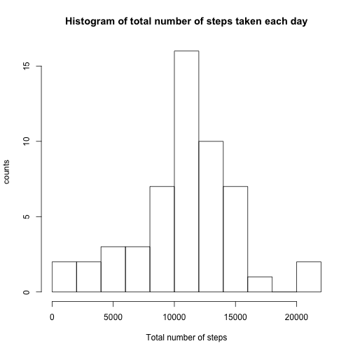
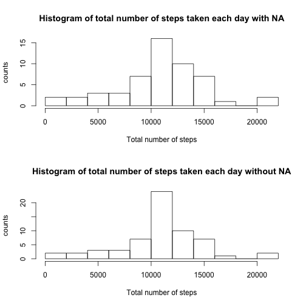

## Loading and preprocessing the data


```r
#library(dplyr)

activity <- read.csv(unz("activity.zip", "activity.csv"), stringsAsFactors=FALSE,na.strings="Not Available",header = TRUE, fill = TRUE, sep = ",")

activity[, 1]  <- as.numeric(activity[, 1])
```

```
## Warning: NAs introduced by coercion
```

```r
activity[, 2]  <- as.Date(activity[, 2])
activity[, 3]  <- as.numeric(activity[, 3])
```

## What is mean total number of steps taken per day?


```r
sum_act <- aggregate.data.frame(activity[1], by = list(activity[,2]), FUN=sum)
colnames(sum_act) <- c("Date","Total number of steps")

x1<-matrix(sum_act$`Total number of steps`,ncol=length(sum_act$`Total number of steps`),nrow=1)
colnames(x1) <- as.character(sum_act$Date)
barplot(x1, space=0, axisnames = TRUE, ylab="Number of steps", xlab = "Following day")
```




The mean number of steps and the median for total number of steps taken per day:


```r
mean_tot <- mean(sum_act[,2], na.rm = TRUE)
mean_tot
```

```
## [1] 10766.19
```

```r
median_tot <- median(sum_act[,2], na.rm = TRUE)
median_tot
```

```
## [1] 10765
```


## What is the average daily activity pattern?

A total time series plot of the 5-minute interval and number of steps per day:

```r
#plot(activity$steps, type="l", xlab="Time", ylab= "Steps", col="green" , lwd=1)
```


The daily time series, with averaged number of steps, to show the activity pattern:


```r
meansteps <- aggregate(activity$steps, list(as.numeric(activity$interval)), FUN="mean", na.rm = TRUE)
names(meansteps) <- c("interval","mean")

plot(meansteps, type="l", xlab="Interval", ylab="Average Number of Steps", main="Daily Steps Taken on Average, by Interval", col="green" , lwd=1)
```


And which averaged interval is the maximum?

```r
intmean<- aggregate(activity$steps, list(as.numeric(activity$interval)), data=activity, FUN =mean, na.rm=TRUE)
names(intmean) <- c("interval", "interval.mean")
intmean[which.max(intmean$interval.mean),]
```

```
##     interval interval.mean
## 104      835      206.1698
```

## Imputing missing values

The number of missing values

```r
nas <- sum(is.na(activity$steps))
nas
```

```
## [1] 2304
```

Which gives the percentage:

```r
percentage <- nas/length(activity[,1])*100
percentage
```

```
## [1] 13.11475
```

We have planty of NAs, so we do something with them. We assign the mean for the interval computed before.


```r
newsetstep <- rep(0,length(activity[,1]))
newset2 <- cbind(newsetstep, as.Date(activity$date), activity$interval)
newset3 <- activity

for (i in 1:length(activity[,1]))
{
  if (is.na(newset3[i,1] == TRUE) )
  {
        meanstep <- meansteps$mean[which(as.numeric(meansteps$interval) == as.numeric(newset3[i,3]))]
        newset3[i,1] = meanstep
  }
  else newset3[i,1] = activity[i,1]
}
```

Let us make the new histogram

```r
sum_new <- aggregate.data.frame(newset3[1], by = list(newset3[,2]), FUN=sum, na.rm=TRUE)
colnames(sum_new) <- c("Date","Total number of steps")

x2<-matrix(sum_new$`Total number of steps`,ncol=length(sum_new$`Total number of steps`),nrow=1)
colnames(x2) <- as.character(sum_act$Date)
barplot(x2, space=0, axisnames = TRUE, ylab="Number of steps", xlab = "Following day")
```


Which is, in compirison with the old one:


```r
par(mfcol=c(2,1))
barplot(x1, space=0, axisnames = TRUE, ylab="Total number of steps", xlab = "Following day",main="Measures with NA")
barplot(x2, space=0, axisnames = TRUE, ylab="Total number of steps", xlab = "Following day",main="Measures without NA")
```



The new mean number of steps and the median are:


```r
mean_tot_new <- mean(sum_new[,2])
mean_tot_new
```

```
## [1] 10766.19
```

```r
median_tot_new <- median(sum_new[,2])
median_tot_new
```

```
## [1] 10766.19
```

Which gives the differences:

```r
mean_tot_new - mean_tot
```

```
## [1] 0
```

```r
median_tot_new - median_tot
```

```
## [1] 1.188679
```

We can see, that implementing that method does not change the mean, but makes the median to be equal to the mean. It seems to not change the days with most of total number of steps, but it changes most of the measures on histogram which used to have NA counts. 

## Are there differences in activity patterns between weekdays and weekends?


Creating a new dataset:

```r
## Reframe:

days1 <- weekdays(as.Date(newset3$date), abbreviate = TRUE);
days2 <- gsub("Sun|Sat", "weekend",days1)
days3 <- gsub("Mon|Tue|Wed|Thu|Fri", "weekday",days2)

week_days <- cbind(newset3$steps,  days3, newset3$interval,newset3$date)
colnames(week_days) <- c("steps","week or end","intervals","date")
week_days2 <- data.frame(week_days)
```


making averaged plots:

```r
anormaldays <- week_days2[which(week_days2$week.or.end=="weekday"),]
aweekends <- week_days2[which(week_days2$week.or.end=="weekend"),]

aveweekend <- aggregate(as.numeric(aweekends$steps), list(as.numeric(aweekends$intervals)), FUN="mean", na.rm = TRUE)
names(aveweekend) <- c("interval","mean")

aveday <- aggregate(as.numeric(anormaldays$steps), list(as.numeric(anormaldays$intervals)), FUN="mean", na.rm = TRUE)
names(aveday) <- c("interval","mean")

#fixing interval gaps
aveday[,1] <- meansteps[,1]
aveweekend[,1] <- meansteps[,1]
```


```r
par(mfrow=c(2,1)) 

plot(aveday, type="l", xlab="Interval", ylab="Average Number of Steps", main="Daily steps Taken on Average, weekends", col="green" , lwd=1)

plot(aveweekend, type="l", xlab="Interval", ylab="Average Number of Steps", main="Daily steps Taken on Average, weekdays", col="green" , lwd=1)
```


Be careful with the data interpretation: if the mean of steps is 0 there is a high probability that there are missing data there.

